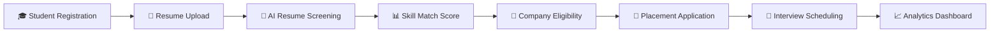
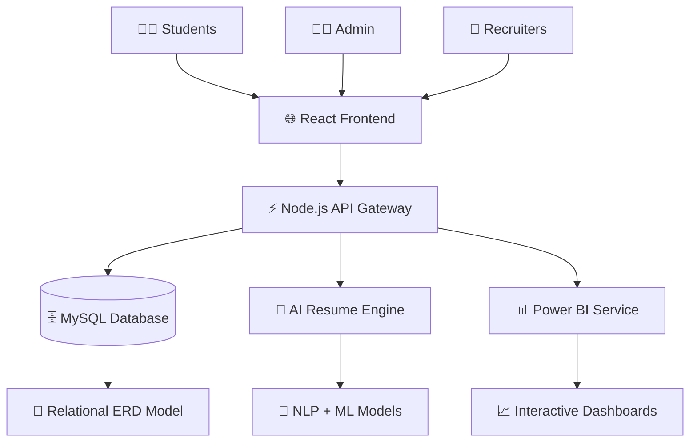
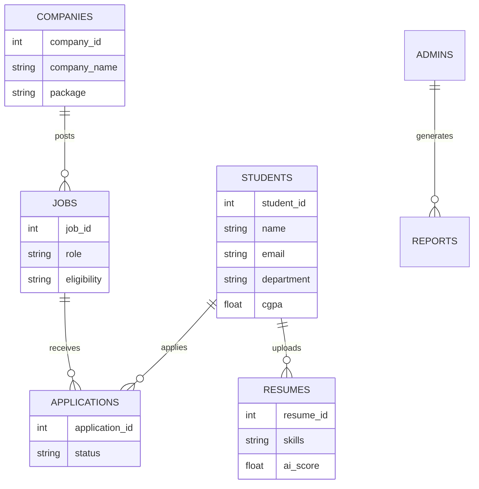
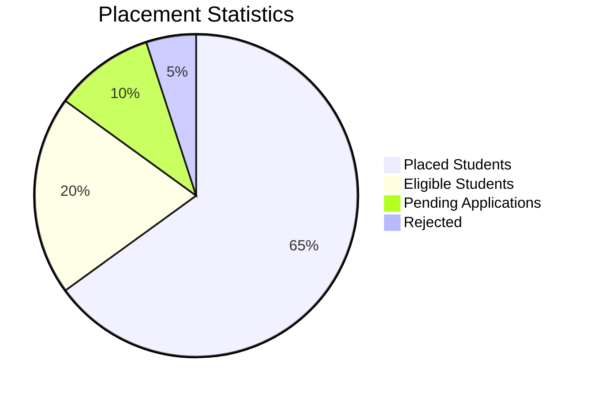
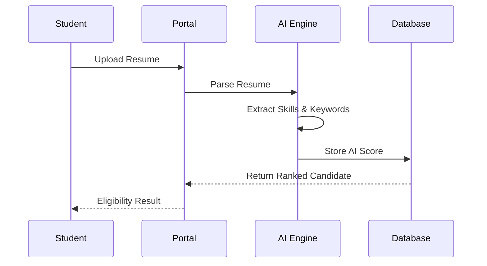

# 🎓 Campus Placement Portal — Animated GitHub README

<div align="center">


<br/>


</div>

---

# 🚀 Overview

The **Campus Placement Portal** is a full-scale intelligent recruitment ecosystem designed for colleges and universities.

It streamlines:

* 🎯 Student Placement Management
* 🏢 Company Recruitment Drives
* 📄 AI Resume Screening
* 📊 Real-Time Placement Analytics
* 🔔 Automated Notifications
* 📈 Power BI Reporting
* 🔐 Role-Based Secure Access

---

# ✨ Animated Workflow



---

# 🧠 System Architecture



---

# 🗂️ ER Diagram



---

# ⚙️ Core Features

<table>
<tr>
<td width="50%">

## 🎓 Student Module

* Resume Upload
* Profile Builder
* Job Applications
* Placement Tracking
* Skill Analysis
* AI Suggestions

</td>

<td width="50%">

## 🏢 Recruiter Module

* Job Posting
* Candidate Filtering
* AI Screening
* Interview Scheduling
* Hiring Pipeline

</td>
</tr>
</table>

---

<table>
<tr>
<td width="50%">

## 👨‍💼 Admin Module

* User Management
* Placement Statistics
* Department Reports
* Access Control
* Notifications

</td>

<td width="50%">

## 🤖 AI Engine

* Resume Parsing
* Skill Extraction
* ATS Scoring
* NLP Matching
* Candidate Ranking

</td>
</tr>
</table>

---

# 🛠️ Tech Stack

<div align="center">

| Layer           | Technology                  |
| --------------- | --------------------------- |
| Frontend        | React.js + Tailwind CSS     |
| Backend         | Node.js + Express.js        |
| Database        | MySQL / PostgreSQL          |
| AI Engine       | Python + NLP + Transformers |
| Dashboard       | Power BI                    |
| Authentication  | JWT + OAuth                 |
| Cloud           | AWS / Azure                 |
| Version Control | Git + GitHub                |

</div>

---

# 📊 Power BI Analytics



### Dashboard Insights

* 📈 Highest Hiring Companies
* 🧠 Skill Gap Analysis
* 🎯 Placement Ratio
* 🏫 Department-wise Performance
* 💼 Average Salary Trends

---

# 🤖 AI Resume Screening Engine



---

# 🔐 Authentication & Security

* ✅ JWT Authentication
* 🔒 Password Encryption
* 🛡️ Role-Based Access Control
* ☁️ Secure Cloud Storage
* 🔍 Audit Logging

---

# 📁 Project Structure

```bash
Campus-Placement-Portal/
│
├── frontend/
│   ├── components/
│   ├── pages/
│   ├── hooks/
│   └── assets/
│
├── backend/
│   ├── routes/
│   ├── controllers/
│   ├── middleware/
│   └── services/
│
├── ai-engine/
│   ├── resume-parser/
│   ├── nlp-models/
│   └── ranking-engine/
│
├── database/
│   ├── schema.sql
│   └── erd/
│
├── powerbi-dashboard/
│
└── README.md
```

---

# 🚀 Installation

## Clone Repository

```bash
git clone https://github.com/your-username/campus-placement-portal.git
cd campus-placement-portal
```

## Install Frontend

```bash
cd frontend
npm install
npm start
```

## Install Backend

```bash
cd backend
npm install
npm run dev
```

## Run AI Engine

```bash
cd ai-engine
pip install -r requirements.txt
python app.py
```

---

# 🌟 Future Enhancements

* 🎥 AI Mock Interviews
* 📱 Mobile Application
* 🌐 Multi-College Integration
* 🧠 Recommendation Engine
* 🔔 Real-Time Chat System
* 📡 Blockchain Verification

---

# 📸 Preview Section

```md
Add screenshots/gifs here
```

Example:

<p align="center">
  
</p>

---

# 📈 GitHub Stats

<div align="center">


</div>

---

# 🤝 Contributors

<table>
<tr>
<td align="center">

<br />
<b>Your Name</b>
</td>
</tr>
</table>

---

# 💡 Vision

> “Transforming traditional campus recruitment into an AI-driven intelligent hiring ecosystem.”

---

# 📜 License

This project is licensed under the MIT License.

---

<div align="center">

# ⭐ Star This Repository If You Like It!


</div>

